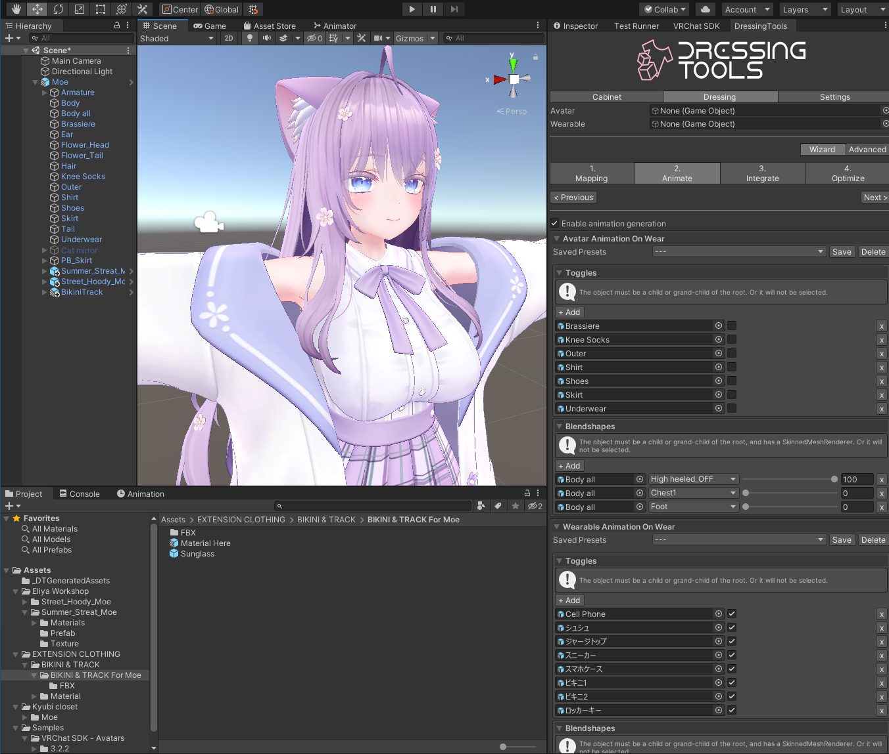
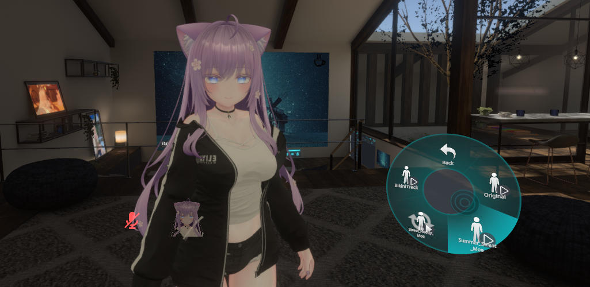

  
  
   
   
  
  

    A simple but advanced, non-destructive and automated cabinet system.
  

  
   
  
  
   
   

  [BOOTH Page](https://chocopoi.booth.pm/items/3639300) | [Getting Started](https://dressingtools.chocopoi.com/)

> :warning: v2 is not ready for production use yet! You might be actually finding for the v1 version right now: https://github.com/poi-vrc/DressingTools/tree/1.x :warning:

## Development Screenshots

## License
This project is mainly licensed **under the GPLv3 License**. ([tl;dr](https://tldrlegal.com/license/gnu-general-public-license-v3-(gpl-3))) Please make sure your derived project is licensed under the GPLv3 and published open-source to the users.

Please be noted that logo assets resources in the `logo` folder is [separately licensed under specific terms](logo/README.md) by **chocopoi**.

Copyright (c) 2022-2023 poi-vrc.
