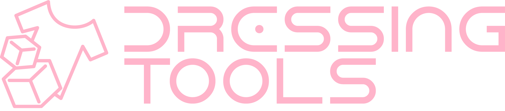

  
  
   
   
  
  

  A simple but advanced, non-destructive cabinet system.
   
  シンプルだが高度な非破壊キャビネットシステム
   
  一個簡單但進階的、無損衣櫃系統
  

   
  
  
  [Getting Started](https://dressingtools.chocopoi.com/) / [はじめに](https://dressingtools.chocopoi.com/ja/) / [入門](https://dressingtools.chocopoi.com/zh-Hant/)
  
  [BOOTH](https://chocopoi.booth.pm/items/3639300) | [Discord](https://discord.gg/Gyst8Pr2ay) | [Twitter](https://twitter.com/chocolapoi)

https://github.com/poi-vrc/DressingTools/assets/77053052/6cc4f998-321e-4b4b-a99f-f0e8f2bb6ffc

[[Play in YouTube]](https://youtu.be/WKYKn1aTLwg)

## API Stability / APIについて

There is no guarantee on API stability. A minor update could include breaking changes.

現在、API安定性の保証はありません。Minorアップデートに破壊的なAPI変更を含む可能性があります。

## Third-party Notices / サードパーティ通知

DressingTools integrates components, source codes and other resources from third-party projects that could be distributed under licenses different than the one used by our repositories. For more details, please read the [third-party notices file](THIRD-PARTY-NOTICES.md).

リポジトリで使用されているものとは異なるライセンスの下で、配布される可能性のあるサードパーティのプロジェクトからのコンポーネント、ソースコード、およびその他のリソースを統合しています。詳細については、[サードパーティ通知ファイル](THIRD-PARTY-NOTICES.md)をお読みください。

## Licensing / ライセンス

The project is mostly licensed under the GNU General Public License v3.0 (GPLv3).

プロジェクトの大部分は、GNU General Public License v3.0 (GPLv3) にライセンスされています。

https://dressingtools.chocopoi.com/docs/extending-dt/licensing/

Copyright (c) 2022-2024 poi-vrc.
